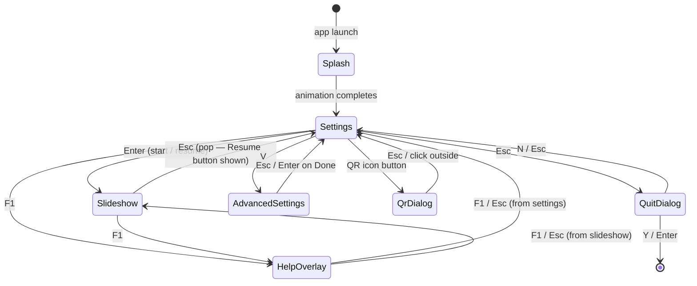

# picture-show3 — User Interaction Flow

## Page state transitions



## Settings page keyboard map

| Key | Action |
|-----|--------|
| `Enter` | Start / Resume picture show |
| `T` | Cycle transition style |
| `S` | Cycle sort order |
| `L` | Toggle loop |
| `A` | Toggle autoplay |
| `B` | Open folder browser |
| `H` | Open recent folders popup (↑↓ navigate, Enter select) |
| `R` | Cycle star rating filter |
| `V` | Open Advanced settings |
| `F` | Toggle fullscreen |
| `F1` | Help overlay |
| `Esc` | Quit confirmation dialog |

## Slideshow page keyboard map

| Key | Action |
|-----|--------|
| `→` / `←` | Next / previous image |
| `Space` | Play / pause (popup visible 3 s with countdown border) |
| `↑` / `↓` *(play popup)* | Enter interval edit mode, increment / decrement seconds |
| `1`–`9` *(play popup)* | Enter interval edit mode, set first digit |
| `↵` *(interval edit)* | Confirm new interval, start autoplay |
| `Esc` *(interval edit)* | Cancel, leave autoplay stopped |
| `F` | Toggle fullscreen |
| `I` | Toggle HUD info bar |
| `,` | Toggle EXIF panel |
| `J` | Jump-to-image dialog |
| `0`–`5` | Rating overlay (↵ confirm · Esc cancel) |
| `C` | Caption editor overlay (↵ save · Esc cancel · Tab Tab copy prev) |
| `F1` | Help overlay |
| `Esc` | Close open overlay → exit to settings |
| Double-click | Toggle fullscreen |

## Overlay z-order (SlideshowPage)

```
z: 0–2   image layers (layerA / layerB)
z: 10    HudBar
z: 11    ExifPanel
z: 20    play/pause popup
z: 30    jump dialog / rating overlay / caption overlay
z: 50    intro fade overlay (black, shown on page open)
```

## Resumed-show reset rules

| Action while resumed | Effect |
|---|---|
| Change folder | Start button resets to "Start" |
| Change sort order | Start button resets to "Start" |
| Change min rating filter | Start button resets to "Start" |
| Change transition / loop / autoplay | No reset — resume continues |
